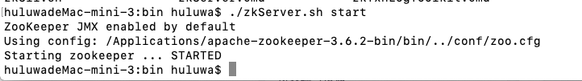
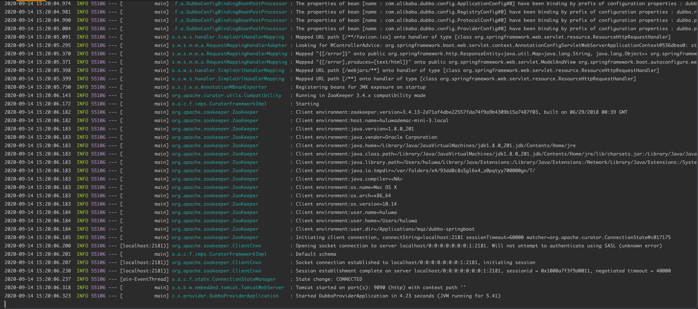
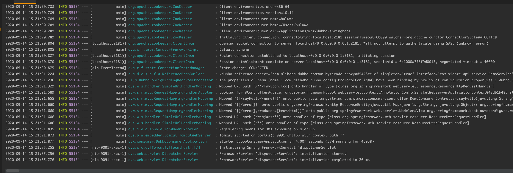
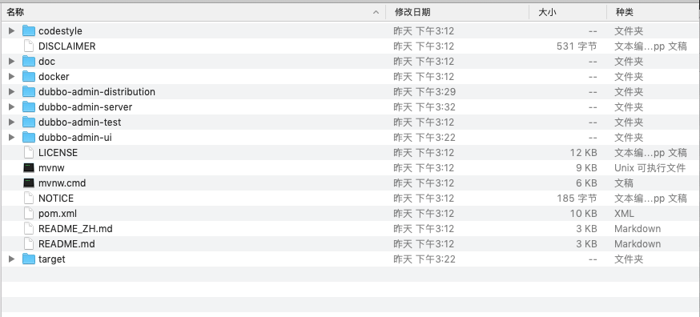
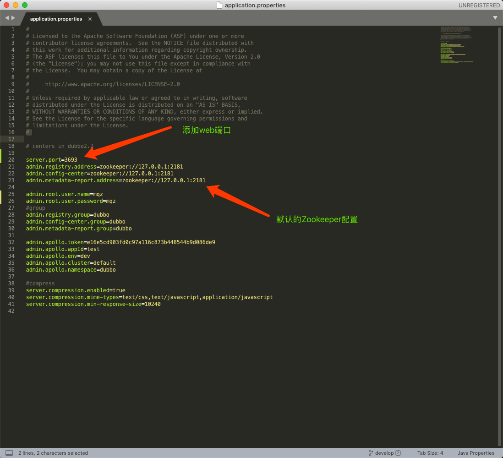
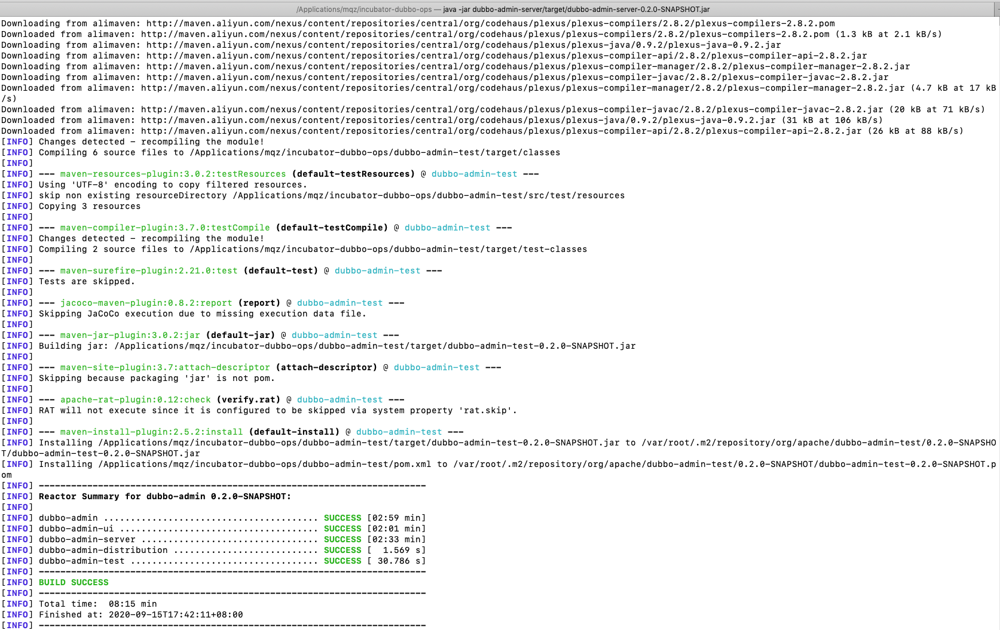

# rpc-ex-pro
    springboot-dubbo
    
    springboot dubbo 示例项目
    dubbo官方文档：http://dubbo.apache.org/zh-cn/index.html
    推荐使用注册中心：zookeeper
    
    
    
#Zookeeper起飞~
zookeeper的安装就不一一赘述了，最主要就是要添加一个zoo.cfg配置文件，具体安装可参见官方文档或某歌

#项目启动
1.首先启动服务提供方注册到zookeeper

2.服务消费方启动

    
# 使用dubbo-admin管控
1.下载dubbo-admin的源码： git clone https://github.com/apache/dubbo-admin

2.进入dubbo-admin-server目录，修改application.properties配置文件

3.进入项目根目录打包，而不是dubbo-admin-server下打包，因为需要UI界面， mvn clean install -DskipTests=true，耗时有点长

4.运行打包后的dubbo-admin.jar  java -jar dubbo-admin-server/target/dubbo-admin.jar

- by mqz

    
